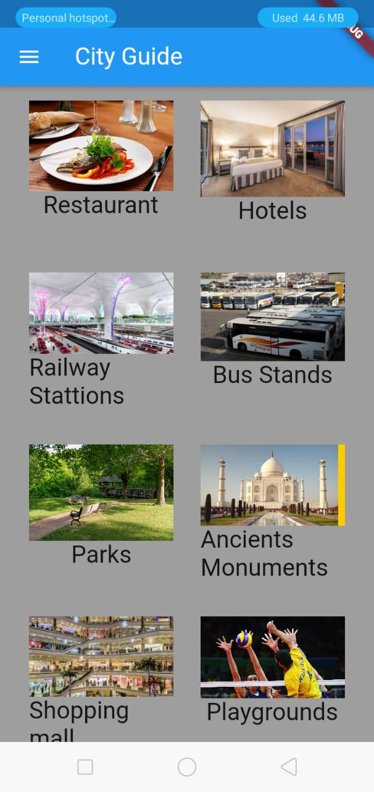
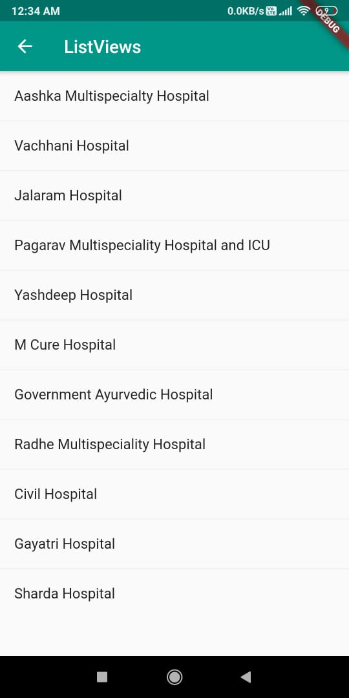

# City Guide App

* This was our first project in Flutter.
* In this project we applied the concept of OOPs.
* We used Firebase for sign up with google.
* The main goal of this project is to solve the problem of tourist who was unable to find different touring places in an unknown city.

# Screenshots

